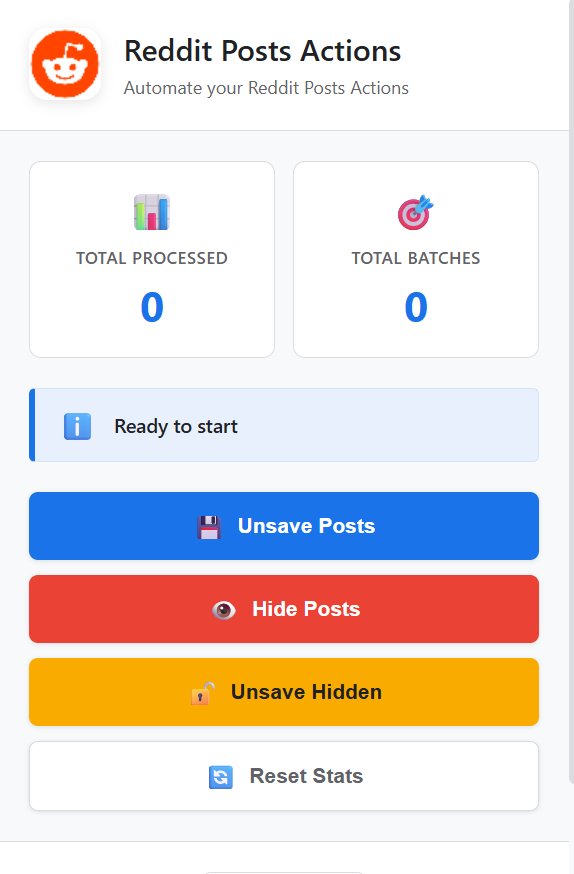
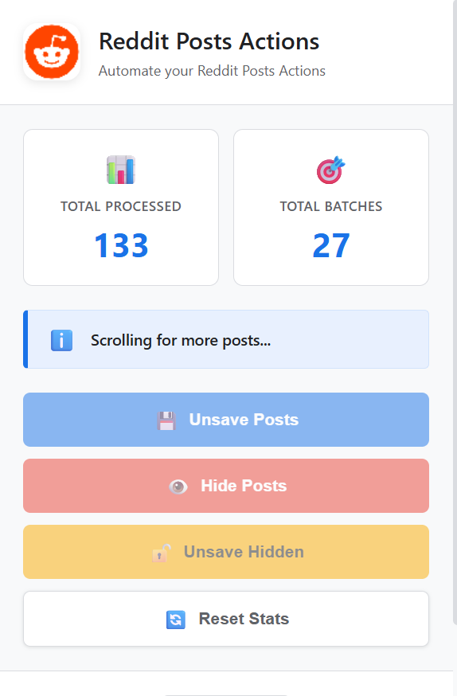

# Reddit Posts Actions

Automate Unsaving or hiding posts with this Chrome extension!

## ✨ Features

- **Unsave Posts**: Automatically remove posts from your saved collection
- **Hide Posts**: Bulk hide posts from your feed
- **Unsave Hidden Posts**: Remove posts that were hidden from your saved collection

    <h3 style="margin-top: 0; color: #cc0000;">⚠️ Important Limitation</h3>
    
Chrome pauses scripts in background tabs. To ensure this extension works:

    <ul>
        <li><strong>Keep the Reddit tab active and focused.</strong></li>
        <li><strong>Do not</strong> switch tabs or minimize the window.</li>
        <li><strong>Prevent</strong> the screen from sleeping.</li>
    </ul>
    
This is a browser restriction, not a bug. If these limitations are annoying, we recommend using <a href="https://github.com/iamxeeshankhan/reddit-posts-actions/blob/master/console.js">console.js</a>.

## 📸 Screenshots

### Extension Interface

  
  

## How to use

### Option 1: Console (Recommended)

1. Open your Reddit saved posts page: `https://www.reddit.com/user/<username>/saved/`
2. Open Chrome DevTools by pressing **F12**.
3. Copy all the code from [`console.js`](https://github.com/iamxeeshankhan/reddit-posts-actions/blob/master/console.js) and paste it into the **Console** tab.
4. Press **Enter** to run the script.
5. DON'T CLOSE THE TAB

### Option 2: Chrome Extension

- Download the Extension
- Open Chrome Extensions Page
  - Navigate to `chrome://extensions/`
  - Or click: Menu (⋮) → Extensions → Manage Extensions
- Toggle the "Developer mode" switch in the top-right corner
- Load the Extension
  - Click "Load unpacked"
  - Select the `reddit-posts-actions` folder
  - The extension icon should appear in your toolbar
- Navigate to your saved posts
  - `https://www.reddit.com/user/{your-username}/saved/`
  - Or click your profile → Saved
- Click the Reddit Posts Actions extension icon in your Chrome toolbar
- Choose your action:
  - Click **"Unsave Posts"** to remove posts from saved
  - Click **"Hide Posts"** to hide posts from your feed
  - Click **"Reset Stats"** to clear statistics

## Reddit "Unsave" Element Hierarchy (for analysis)

This guide maps the nested structure of Reddit's interface to help maintainers update the script when the UI changes.

### 🏗️ The DOM Path

To reach the **Unsave** button, the script traverses these layers:

- **`shreddit-feed` (Shadow DOM element)**: The main container. Its a shadow DOM element
- **`Slot`**: This slot is the parent of article
- **`article`**: This is the element in which all the saved posts are loaded.
- **`shreddit-post` (Shadow DOM element)**: The internal structure of that post.
- **`slot="credit-bar"`**: A designated area for menu icons.
- **`span`**: A wrapper for the menu loader.
- **`shreddit-async-loader` (Shadow Root)**: Loads the menu content.
- **`shreddit-post-overflow-menu` (Shadow Root)**: The "three dots" menu component.
- **`overflow-button`**: The actual clickable menu icon.
- **`rpl-dropdown` (Shadow Root)**: The dropdown logic.
- **`rpl-popper` (Shadow Root)**: The pop-up container.
- **`faceplate-menu` (Slot/Shadow)**: The final list containing the **Remove from Saved** button.

## 💡 Quick Tips for Maintainers

- **Shadow Root**: You cannot find these with normal CSS. You must use `.shadowRoot` to enter each layer.
- `console.log(<shadowroot_object>.children)` to view all the elements of a selected shadowRoot
- **Slots**: These are "windows" showing content from elsewhere. Use `.assignedElements()` to see what is inside them.
- **Maintenance**: If the script breaks, check if Reddit changed the **Slot** number (currently 2) or renamed the **credit-bar** slot.

## 👨‍💻 Author

**M. Zeeshan Khan**

- GitHub: [@iamxeeshankhan](https://github.com/iamxeeshankhan)
- Repository: [reddit-posts-actions](https://github.com/iamxeeshankhan/reddit-posts-actions)

**If you find this extension useful, please ⭐ star the repository!**

[Report Bug](https://github.com/iamxeeshankhan/reddit-posts-actions/issues) · [Request Feature](https://github.com/iamxeeshankhan/reddit-posts-actions/issues)
